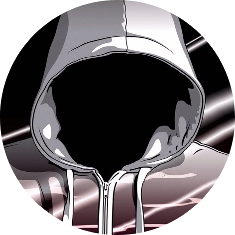

<h1 align="center">Stellarch Packages</h1>
<div align="center">
    <a href="https://github.com/TheWisker/Stellarch">
        
    </a>
</div>
<p align="center">Stellarch Distro Package Sources</p>

<h2 align="center">Index</h2>

<div align="center">

  [Description][description]

  [Packages][packages]

  [Install][install]

  [Contributions][contributions]

  [License][license]

  [Code of Conduct][coc]

  [Author][author]

</div>

<h2 align="center">Description [<a href="https://github.com/TheWisker/Packages#index">↑</a>]</h2>

<p align="center">Stellarch distro <b>package sources</b> repository</p>

<h2 align="center">Packages [<a href="https://github.com/TheWisker/Packages#index">↑</a>]</h2>

The packages currently mantained are:

- <S> *linux-stellarch*: Stellarch Linux kernel and modules.
- <S> *linux-stellarch-headers*: Stellarch Linux headers and scripts.
- <B> *amy-icon-theme*: Amy dark icons for linux desktop.
- <A> *awesome-git*: Highly configurable framework window manager.
- *cavasik*: Audio visualizer based on CAVA.
- <S> *dotfiles*: Collection of Linux dotfiles.
- <A> *dropbox*: A free service that lets you bring your photos, docs, and videos anywhere and share them easily.
- <B> *enchanted-sound-theme*: Enchanted complete system sounds.
- <A> *f3*: Simple tool that tests flash cards capacity and performance to see if they live up to claimed specifications.
- *hyperfluent-grub-theme*: Fluent, modern, and clean GRUB theme.
- <A> *jdownloader2*: Download manager, written in Java, for one-click hosting sites like Rapidshare and MEGA. Uses its own updater.
- *millennium*: Millennium is an open-source low-code modding framework to create, manage and use themes/plugins for the desktop Steam Client without any low-level internal interaction or overhead.
- <U> *nody-greeter*: LightDM greeter that allows to create wonderful themes with web technologies. Made in Node.js.
- <B> *orchis-gtk-theme*: Flat Materia Gtk+ theme based on Elegant Design.
- <B> *orchis-kvantum-theme*: Flat Materia Kvantum theme based on Elegant Design.
- <A> *pdd*: Tiny date, time diff calculator.
- <A> *popcorntime*: Stream movies from torrents. Skip the downloads. Launch, click, watch.
- <A> *prelink*: ELF prelinking utility to speed up dynamic linking.
- <A> *preload*: Makes applications run faster by prefetching binaries and shared objects.
- <L> *proton-ge*: Compatibility tool for Steam Play based on Wine and additional components. Always latest version.
- *python-i686-bin*: Major release 3.11 of the Python high-level programming language (32-bit).
- *pywalfox*: Dynamic theming of Firefox using Pywal colors.
- <U> *sea-greeter*: LightDM greeter made with WebKit2GTK.
- *shikai-theme*: Modern lightdm webkit2 theme.
- <U> *suwayomi*: A rewrite of Tachiyomi for the Desktop.
- *tabmanager-extension*: WebExtensions for restoring and saving window / tab states.
- <A> *trackma*: A lightweight and simple program for updating and using lists on several media tracking websites.
- *ultimmc*: Free, open source launcher and instance manager for Minecraft.
- <A> *ventoy*: A new bootable USB solution.
- <S> *wallpapers*: Personal collection of wallpapers curated over time for their visual appeal, mood, and artistic value.
- *web-greeter*: A modern, visually appealing greeter for LightDM.
- <A> *xclicker*: A blazing fast gui autoclicker for linux.
- <B> *xcursor-hacked*: Hacked Serie X11 cursor themes, is a modification of the variation Hacked of Breeze Cursors by Ken Vermette.
- <S> *zhou-theme*: Dynamic and aesthetic AwesomeWM theme.

Where the symbols mean:

- *<S>*: Stellarch distro related package, thightly related to the distro.
- *<A>*: [AUR][aur] mirrored package with little to no modifications.
- *<B>*: Package includes its sources.
- *<U>*: Currently unmantained package.
- *<L>*: Always latest version package. These are packages written to automatically detect latest version and install it.

<h2 align="center">Install [<a href="https://github.com/TheWisker/Packages#index">↑</a>]</h2>

This repository doesnt host any sources except for certain packages (<B>) with no suitable external sources.
Thus, to install packages, internet is usually a requirement. Packages are installed using makepkg as they follow [ABS][abs].

An example of building and installing a package using **[makepkg][makepkg]**:

```shell
# Inside the directory containing the PKGBUILD:
makepkg -si
```

Where the **-s** flag attempts to install runtime and buildtime dependencies and the **-i** flag intalls the resulting built package.

<h2 align="center">Contributions [<a href="https://github.com/TheWisker/Packages#index">↑</a>]</h2>

All contributions are and will be stated at the top of PKGBUILD files as either Mantainer or CoMantainer comments.

<h2 align="center">License [<a href="https://github.com/TheWisker/Packages#index">↑</a>]</h2>

All PKGBUILD files in this repository follow the [GPL-3.0 license][license] and source tarballs included follow the licenses of their original projects.

<h2 align="center">Code of Conduct [<a href="https://github.com/TheWisker/Packages#index">↑</a>]</h2>

<p align="center"> This project follows the <a href="./.github/CODE_OF_CONDUCT.md"><b>Contributor Covenant Code of Conduct</b></a>.</p>

<h2 align="center">Author [<a href="https://github.com/TheWisker/Packages#index">↑</a>]</h2>
<div align="center">
    <a href="https://github.com/TheWisker">
        </img>
    </a>
</div>
<h4 align="center">TheWisker</h4>

[description]: https://github.com/TheWisker/Packages#description-
[packages]: https://github.com/TheWisker/Packages#packages-
[install]: https://github.com/TheWisker/Packages#install-
[contributions]: https://github.com/TheWisker/Packages#contributions-
[license]: https://github.com/TheWisker/Packages#license-
[coc]: https://github.com/TheWisker/Packages#code-of-conduct-
[author]: https://github.com/TheWisker/Packages#author-

[aur]: https://wiki.archlinux.org/title/Arch_User_Repository
[abs]: https://wiki.archlinux.org/title/Arch_build_system
[makepkg]: https://man.archlinux.org/man/makepkg.8.en
[license]: ./LICENSE
